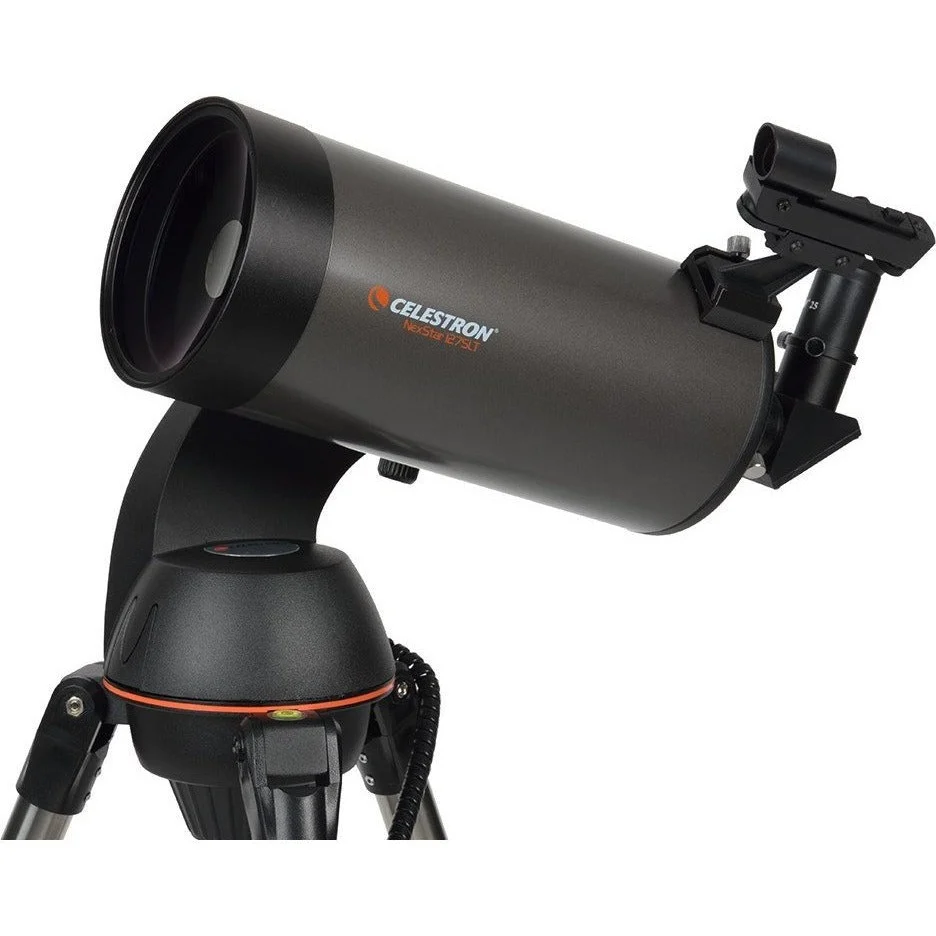

# 设备列表

本页面为**广州外国语学校天文台**核心观测设备清单及详细参数，用于天文观测、天体摄影与科普教学。文中若有标注如[1](#)角标的，说明该内容存疑或有特殊说明，请注意确认。

本清单仅供天文台内部参考，不构成对实际持有设备数量、种类及状态的确认或承诺，亦不得作为财务统计或资产盘点依据。清单可能存在遗漏、滞后或误差，请以实物为准。

:::info

设备盘点截止 **2026-08-22**，仅供参考，统计可能出现误差

:::

经纬仪的参数在对应望远镜套装中列出

如无特别说明，后文所述的**天文台主镜**均指校内顶楼天文台圆顶中的[**RC14**](#gso-rc14)望远镜

---

## 🔭 望远镜

:::info

此标注“🧰”是指该望远镜为套装（包含赤道仪等），除此以外，本栏所示设备仅为**主镜**，不包含图中的赤道仪等其他配件

:::

### GSO[^1] RC14

**存量：1 台**

:::info

**GSO[^1]RC14** 采用经典RC 里奇-克雷蒂安（Ritchey-Chrétien）光学系统，使用两个反射镜面，没有折射镜，减少了光量的损失，且无彗差、无球差，提供平坦的大视场与优异的像质，作为天文台主镜。

:::

| 参数 | 规格 |
|:---|:---|
| 光学系统 | RC 里奇-克雷蒂安 (Ritchey-Chrétien) |
| 口径 | 355 mm（14 英寸） |
| 焦距 | 约 2845 mm |
| 焦比 | f/8 |
| 瑞利判据 | 0.32 角秒 |

### 🧰Celestron CPC 800 GPS (XLT)

**存量：1 台**

:::tip

这套望远镜出现在了特伦斯·迪金森的 **《夜观星空》** [^2]的观星器材章节中

:::

| 参数 | 规格 |
|:---|:---|
| 光学系统 | SC 施密特-卡塞格林 |
| 口径 | 203.2 mm（8 英寸） |
| 焦距 | 2032 mm（80 英寸） |
| 焦比 | f/10 |
| 瑞利判据 | 0.69 角秒 |
| 极限星等 | 14 |

**经纬仪存量：1 台**

**经纬仪参数**

| 参数 | 规格 |
|:---|:---|
| 支架类型 | 计算机化双叉臂经纬仪 |
| 高度调节范围（含支架和三脚架） | 1295.4 mm - 1422.4 mm（51英寸 - 66英寸） |
| 三脚架脚管直径 | 50.8 mm（2英寸）不锈钢 |
| 支架头重量（含光学镜筒） | 42 lbs（19.1 kg） |
| 附件盘 | 有 |
| 三脚架重量 | 19 lbs（8.6 kg） |
| 回转速度 | 9档回转速度 - 最高速度5°/秒 |
| 跟踪速率 | 恒星速、太阳速和月球速 |
| 跟踪模式 | 地平式、赤道仪北向、赤道仪南向 |
| GPS | 内置 16 通道 |
| 鸠尾槽 | 无 |
| 自动导星接口 | 是 |
| 电源要求 | 12V DC，1.5A（插头尖端为正极） |
| 校准程序 | 星空校准、自动双星校准、双星校准、太阳系校准、EQ北校准、EQ南校准 |
| 周期误差校正 | 是 |
| 随附物品 | 光学镜筒、支架与三脚架、附件盘、40mm目镜、1.25英寸天顶镜、50mm 9x50寻星镜（含支架）、使用说明书 |

### 🧰Celestron Advanced VX 8"

**存量：1 台**

:::info

实际上，本台望远镜的光学参数与[Celestron CPC 800 GPS (XLT)](#celestron-cpc-800-gps-xlt)几乎完全一致

本台望远镜的寻星镜支架是损坏的

:::

| 参数 | 规格 |
|:---|:---|
| 光学系统 | SC 施密特-卡塞格林 |
| 口径 | 203.2 mm（8 英寸） |
| 焦距 | 2032 mm（80 英寸） |
| 焦比 | f/10 |
| 瑞利判据 | 0.69 角秒 |
| 极限星等 | 14 |

### 🧰Celestron NexStar 4SE

**存量：1 台**

| 参数 | 规格 |
|:---|:---|
| 光学系统 | MC 马克苏托夫-卡塞格林 |
| 口径 | 102 mm（4.02 英寸） |
| 焦距 | 1325 mm（52 英寸） |
| 焦比 | f/13 |
| 瑞利判据 | 1.37 角秒 |
| 极限星等 | 12.5 |

**经纬仪存量：2 台**

**经纬仪参数**

| 参数 | 规格 |
|:---|:---|
| 支架类型 | 电脑化地平式单叉臂经纬仪 |
| 有效载荷 | 10 lbs (4.54 kg) |
| 高度调节范围（含支架和三脚架） | 939.8 mm - 1397 mm (37" – 55") |
| 三脚架脚管直径 | 38.1 mm (1.5") 不锈钢 |
| 支架头重量 | 7 lbs (3.2 kg) |
| 附件盘 | 有 |
| 三脚架重量 | 10 lbs (4.54 kg) |
| 回转速度 | 9档回转速度 - 最高速度3°/秒 |
| 跟踪速率 | 恒星速、太阳速和月球速 |
| 跟踪模式 | 地平式（Alt-Az）、北半球赤道式及南半球赤道式 |
| GPS | 无 |
| 鸠尾槽 | CG-5鸠尾板 |
| 自动导星接口 | 无 |
| 电源要求 | 8节AA电池（不含）及12 VDC 750 mA（尖端为正极） |
| 校准程序 | SkyAlign、一星校准、二星校准、自动二星校准、太阳系天体校准、EQ North / EQ South校准（赤道仪校准需使用赤道楔） |
| 周期误差校正 | 无 |
| 随附物品 | 光学镜筒 单叉臂支架及三脚架 附件盘 Star Pointer寻星镜 内置楔座 NexStar+手控器 25mm目镜 |

### 🧰Celestron NexStar 127SLT

**存量：1 台**

| 参数 | 规格 |
|:---|:---|
| 光学系统 | MC 马克苏托夫-卡塞格林 |
| 口径 | 127 mm（5 英寸） |
| 焦距 | 1500 mm（59 英寸） |
| 焦比 | f/12 |
| 瑞利判据 | 1.1 角秒 |
| 道斯极限 | 0.91 角秒 |
| 极限星等 | 13 |
| 最高有效倍率 | 300x |

**经纬仪存量：1 台**

**经纬仪参数**

| 参数 | 规格 |
|:---|:---|
| 支架类型 | 电脑化地平式单叉臂经纬仪 |
| 有效载荷 | 8 lbs (3.6 kg) |
| 高度调节范围（含支架和三脚架） | 762 mm - 1270 mm（30" - 50"） |
| 三脚架脚管直径 | 31.75 mm（1.25"）不锈钢 |
| 支架头重量 | 5 lbs (2.3 kg) |
| 附件盘 | 有 |
| 三脚架重量 | 5 lbs (2.3 kg) |
| 回转速度 | 9档回转速度 - 最高速度 3°/秒 |
| 跟踪速率 | 恒星速、太阳速和月球速 |
| 跟踪模式 | 地平式（Alt-Az）、EQ North / EQ South |
| 鸠尾槽 | CG-5 saddle plate |
| 自动导星接口 | 无 |
| 电源要求 | 12 VDC（8节AA电池，不含） |
| 校准程序 | SkyAlign、自动二星校准、一星校准、二星校准、太阳系校准 |
| 随附物品 | 光学镜筒、单叉臂支架与三脚架、附件盘、NexStar+手控器、20mm与9mm目镜、StarPointer红点寻星镜、天顶镜 |

### 🧰Celestron Deluxe 80EQ

**存量：1 台**

| 参数 | 规格 |
|:---|:---|
| 光学系统 | 折射式 |
| 口径 | 80 mm（3.1 英寸） |
| 焦距 | 900 mm |
| 焦比 | f/11.2 |
| 瑞利判据 | 1.73 角秒 |
| 极限星等 | 12 |

### 🧰Celestron INSPIRE天启CG3 Pro 80900

**存量：4 台**

| 参数 | 规格 |
|:---|:---|
| 光学系统 | 消色差折射式 |
| 口径 | 80 mm（3.1 英寸） |
| 焦距 | 900 mm |
| 焦比 | f/11.2 |
| 瑞利判据 | 1.73 角秒 |
| 极限星等 | 12 |

### 🧰BOSMA BETA β系列 天罡折射70/900L

**存量：1 台**

| 参数     | 规格              |
| :------- | :---------------- |
| 光学系统 | 折射式            |
| 口径     | 70 mm（2.8 英寸） |
| 焦距     | 900 mm            |
| 焦比     | f/12.9            |
| 瑞利判据 | 1.98 角秒         |
| 极限星等 | 11.1              |

### Seestar S50

**存量：3 台**

:::info

Seestar S50或许是本栏最特殊的存在。以下列出部分参数：

:::

| 参数 | 规格 |
|:---|:---|
| 光学系统 | 3片式复消色差APO（折射式） |
| 传感器 | IMX462 |
| 分辨率 | 1/2.8'' 1920 × 1080 |
| 口径 | 50 mm |
| 焦距 | 250 mm |
| 焦比 | f/5 |
| 视场角 | 0.72° × 1.28° |
| 存储容量 | 64 GB |
| 内置滤镜 | UV/IR CUT滤镜 双窄带滤镜 暗场滤镜 |

### Sky-Watcher HELIOSTAR-76Hα 太阳望远镜

**存量：1 台**

:::info

**Heliostar 76mm** 是一款专业的 H-Alpha（氢阿尔法）太阳望远镜，专为太阳目视观测与摄影设计。该望远镜采用多重安全防护技术保护观测者眼睛：包括红外热反射膜、隔热滤镜及紫外光阻隔滤镜。通过前后端滤镜组合，仅允许氢原子发射的 656.28 nm 波长单色光通过，同时阻隔其他波长的光线，从而实现对 H-α 波段日珥等太阳活动现象的清晰观测。

或许是除了[**RC14**](#gso-rc14)以外天文台最贵的望远镜（现售价约合23000￥）

:::

**光学参数**

| 参数 | 规格 |
|:---|:---|
| 光学系统 | 消色差折射式 |
| 镜片镀膜 | H-Alpha 全多层镀膜 |
| 镜片结构 | 双片式（Doublet） |
| 光学质量 | 衍射极限（1/4 波长） |
| 可调校镜筒 | 否（自对准镜筒） |
| 口径 | 76 mm |
| 焦比 | f/8.3 |
| 焦距 | 630 mm |
| 阻隔滤镜尺寸 | 12 mm |
| 太阳像尺寸 | 6 mm |
| 带宽 | < 0.55Å |

**机械参数**

| 参数 | 规格 |
|:---|:---|
| 调焦器类型 | Crayford 调焦器 |
| 调焦器尺寸 | 2 英寸 |
| 调焦器速度 | 双速 |
| 压缩环 | 否（仅天顶镜有） |
| 镜筒材质 | 铝合金 |
| 镜筒长度 | 24 英寸 |
| 镜筒重量 | 8.4 磅（3.8 kg） |
| 安装环 | 有 |
| 鸠尾槽类型 | V 型 |

**配件**

| 参数 | 规格 |
|:---|:---|
| 目镜 | 20mm 70° 1.25 英寸目镜 |
| 天顶镜 | 12mm 1.25 英寸 H-Alpha 阻隔天顶镜 |
| 相机适配器 | 手机适配器 |
| 附加配件 | 遮光罩 |
| 附带寻星镜 | Heliostar 太阳寻星镜 |
| 说明书 | 数字 PDF |
| 收纳盒 | 有 |

**观测参数**

| 参数 | 规格 |
|:---|:---|
| 道斯极限 | 1.52 角秒 |
| 瑞利判据 | 1.84 角秒 |
| 极限星等 | 11.88 |
| 最小倍率 | 7x |
| 最大倍率 | 150x |
| 附带目镜倍率 | 32x |
| 用途 | 太阳观测（目视与摄影） |

---

## 🌐 赤道仪

### iOptron CEM120

**存量：1 台**

我校天文台选用 iOptron CEM120 中心平衡式赤道仪，它以革命性的“重心居中”设计带来天然的高稳定性与极低振动，并实现 **±3.5 角秒** 的优异周期性跟踪误差，可从容支持长时间深空摄影。整机最高能承载重达 52 kg 的大型望远镜及成像终端，刚性与精度兼备。内置 Wi-Fi 与有线网口，配合精密离合、线缆管理系统和免极星对极轴程序，为远程控制与日常操作提供专业、可靠的保障，是兼顾目视与科研摄影的高品质核心平台。其参数如下（来自iOptron官网）：

| 参数 | 规格 |
|:---|:---|
| 支架类型 | 中心平衡式赤道仪 (CEM) |
| 有效载荷1 | 52 kg（115 lbs），不含平衡重锤 |
| 赤道仪本体重量 | 26 kg（57 lbs） |
| 有效载荷/赤道仪重量比 | 2 |
| 材质 | 全金属 |
| 纬度调节范围2 | 0°~ 68°（0.5角分刻度） |
| 方位调节范围 | ± 5°（3角分刻度） |
| 周期误差（编码器测得）3 | < ±3.5角秒 |
| 蜗杆周期 | 240秒 |
| 周期误差校正 | 永久周期误差校正 (PPEC) |
| 赤经蜗轮 | Φ216 mm，360齿，零背隙 |
| 赤纬蜗轮 | Φ216 mm，360齿，零背隙 |
| 蜗杆 | Φ26 mm |
| 赤经轴 | Φ80 mm，钢制 |
| 赤纬轴 | Φ80 mm，钢制 |
| 赤经轴承 | Φ125 mm |
| 赤纬轴承 | Φ125 mm |
| 平衡重锤杆 | Φ38.1 x 540 mm（不锈钢，防滑，重4.5 kg） |
| 平衡重锤 | 10 kg（22 lbs） |
| 赤道仪底座尺寸 | 210 x 230 mm |
| 电机驱动 | 精密步进电机，128微步驱动 |
| 步进精度 | 0.07角秒 |
| 最大回转速度 | 4°/秒（960倍速） |
| 电源要求4 | 直流12V，5A |
| 中天处理 | 停止（0-14°过中天），自动翻转 |
| 零位 | 自动搜索零位 |
| 停放位置 | 水平、垂直、当前、高度/方位角输入 |
| 水平指示器 | 有 |
| 鸠尾槽 | Losmandy D 型 |
| 自动导星接口 | ST-4 |
| 通讯接口 | RS232、USB、LAN、WiFi |
| 工作温度 | -10°C ~ +40°C |

**注释：**

1. 取决于光学镜筒（OTA）的尺寸和长度。
2. 如果您所在纬度低于10°，请联系 iOptron 购买低纬度重锤（#7326LL）。
3. 在测试台上用编码器测得，周期240秒。
4. 随附的交流适配器仅供室内使用。

### Sky-Watcher HEQ5 PRO

**存量：1 台**

| 参数 | 规格 |
|:---|:---|
| 支架类型 | 德式赤道仪 |
| 有效载荷 | 13.7 kg |
| 三脚架高度 | 97-121 cm |
| 导星速度 | 0.25X、0.50X、0.75X 或 1X |
| 平衡重锤 | 2 × 5.1 kg |
| 附件盘 | 大型全覆盖式 |
| 三脚架重量 | 5.6 kg，1.75 英寸钢制三脚架 |
| 回转速度 | 最高 3.4°/秒（800倍速） |

### Celestron Advanced VX

**存量：1 台**

| 参数 | 规格 |
|:---|:---|
| 支架类型 | 电脑化德式赤道仪 |
| 有效载荷 | 30 lbs (13.6 kg) |
| 高度调节范围 (含本体和三脚架) | 1118 mm - 1626 mm (44" – 64") |
| 三脚架脚管直径 | 50.8 mm (2") 不锈钢 |
| 纬度调节范围 | 7° - 77° |
| 赤道仪本体重量 | 17 lbs (7.71 kg) |
| 附件盘 | 有 |
| 三脚架重量 | 18 lbs (8.16 kg) |
| 平衡重锤 | 1 x 12 lbs |
| 回转速度 | 9档回转速度 - 最高速度 4°/秒 |
| 跟踪速率 | 恒星速、太阳速和月球速 |
| 跟踪模式 | 北半球赤道仪模式与南半球赤道仪模式 |
| 鸠尾槽 | 双鞍板 (兼容CG-5和CGE燕尾板) |
| 自动导星接口 | 有 |
| 电源要求 | 12V DC 3.5A (插头尖端为正极) |
| 校准程序 | 2星校准、1星校准、太阳系天体校准、上次校准、快速校准 |
| 随附物品 | Advanced VX 赤道仪本体 \| 三脚架 \| 附件盘 \| 1个12 lbs重锤 \| NexStar+手控器 \| 直流电源线 (插入点烟器插座) |

### Celestron CG3 Pro 德式赤道仪

**存量：4 台**

### R.I.A 赤道仪

**存量：1 台**

### BOSMA EM45

**存量：1 台**

### Sky-Watcher EQ3

**存量：1 台**

| 参数 | 规格 |
|:---|:---|
| 支架类型 | 德式赤道仪 |
| 有效载荷 | 5.5 kg |
| 微调控制 | 是 |
| 平衡重锤 | 2 x 5.1 kg |
| 附件盘 | 大型全覆盖式 |

### Sky-Watcher EQ3D

**存量：2 台**

| 参数 | 规格 |
|:---|:---|
| 支架类型 | 德式赤道仪 |
| 有效载荷 | 5.5 kg |
| 微调控制 | 是 |
| 平衡重锤 | 1.8 + 3.42 kg 或 5.1 kg |
| 附件盘 | 大型全覆盖式 |

## 📷 相机

### ZWO ASI6200MM PRO

**存量：1 台**

:::info

振旺**旗舰级**黑白深空相机，合成彩色照片需要搭配[2英寸BVR滤镜](#%EF%B8%8F-配件)拍摄，连接在天文台主镜[**RC14**](#gso-rc14)上。

:::

| 参数 | 规格 |
|:---|:---|
| 传感器 | Sony 背照式全画幅 IMX455 传感器 |
| 分辨率 | 61.17MP 9576 × 6388 |
| 像素尺寸 | 3.76 μm × 3.76 μm |
| 靶面尺寸 | Full frame 36 mm x 24 mm |
| 传输速度 | 6.3 FPS |
| 读出噪声 | 0.86e |
| QE % | 91% |
| 满阱 | 51400e |
| ADC | 16 bit |
| DDR3 缓存 | 512 MB |
| 制冷 | 30℃~35℃ below ambient |

### ZWO ASI533MM PRO

**存量：1 台**

:::info

振旺深空摄影入门级相机，合成彩色照片需要搭配[1.25英寸ZWO LRGB滤镜](#%EF%B8%8F-配件)拍摄。

:::

| 参数      | 规格                      |
| :-------- | :------------------------ |
| 传感器    | Sony 背照式 IMX533 传感器 |
| 分辨率    | 9.05MP 3008 × 3008        |
| 像素尺寸  | 3.76 μm × 3.76 μm         |
| 靶面尺寸  | 1'' 11.31 mm x 11.31 mm   |
| 传输速度  | 20 FPS                    |
| 读出噪声  | 1.0e                      |
| QE %      | 91%                       |
| 满阱      | 50000e                    |
| ADC       | 14 bit                    |
| DDR3 缓存 | 256 MB                    |
| 制冷      | 30℃~35℃ below ambient     |

### ZWO ASI585MC

**存量：3 台**

:::info

振旺行星相机。

:::

| 参数 | 规格 |
|:---|:---|
| 传感器 | Sony IMX585 传感器 |
| 分辨率 | 8.29MP 3840 × 2160 |
| 像素尺寸 | 2.9 μm × 2.9 μm |
| 靶面尺寸 | 1/1.2'' 11.2 mm x 6.3 mm |
| 传输速度 | 46.9 FPS |
| 读出噪声 | 0.7e |
| QE % | 88% |
| 满阱 | 40Ke |
| ADC | 12 bit |

### ZWO ASI174MM Mini

**存量：1 台**

:::info

振旺**旗舰款**导星相机，连接在天文台主镜[**RC14**](#gso-rc14)上。

:::

| 参数     | 规格                     |
| :------- | :----------------------- |
| 传感器   | Sony IMX249LLJ           |
| 分辨率   | 1936 × 1216              |
| 像素尺寸 | 5.86 μm × 5.86 μm        |
| 靶面尺寸 | 1/1.2'' 11.3 mm x 7.1 mm |
| 传输速度 | 18.4 FPS                 |
| 读出噪声 | 3.5e                     |
| QE %     | 77%                      |
| 满阱     | 32.4Ke                   |
| ADC      | 12 bit                   |

### ZWO ASI220MM Mini

**存量：2 台**

:::info

振旺导星相机。

:::

| 参数 | 规格 |
|:---|:---|
| 传感器 | SC2210 |
| 分辨率 | 1920 × 1080 |
| 像素尺寸 | 4 μm × 4 μm |
| 靶面尺寸 | 1/1.8'' 7.68 mm x 4.32 mm |
| 传输速度 | 14 FPS |
| 读出噪声 | 0.6e |
| QE % | 92% |
| 满阱 | 8.78Ke |
| ADC | 12 bit |

---

## ⚙️ 配件

:::info

由于统计问题，本栏目并**没有列出所有的配件**。下文所示**主镜使用**指的是该配件正安装在天文台主镜上。

:::

| 名称 | 规格 | 存量 | 备注 | 图片 |
|:---|:---|:---|:---|:---|
| Celestron Ultra Wide 超广角目镜组 | 6mm 9mm 15mm 20mm 表观视场 66° | 6mm×6、9mm×6、15mm×7、20mm×6 | |  |
| 天虎光学1.25英寸赫歇尔太阳滤镜 | | 4 个 | |  |
| ZWO ASIAIR Plus | | 3 个 | | |
| 小米 Redmi Note 14 Pro+（手机） | | 3 台 | 设备控制与拍摄 | |
| ZWO CAA | | 1 个 | 主镜使用 | |
| ZWO EFW | | 1 个 | 主镜使用 | |
| ZWO EFW mini | | 1 个 | | |
| ZWO OAG | | 2 个 | 其一为 OAG-L，主镜使用 | |
| ZWO LRGB | 1.25英寸 | 1 套 | | |
| ZWO IRCut | 1.25英寸 | 3 个 | | |
| BVR 滤镜 | 2英寸 | 1 套 | 主镜使用 | |
| 天虎平场镜 | 1x（for 130APO） | 1 个 | 主镜使用 | |
| ZWO SHO | 2英寸 | 1 套 | 主镜使用 | |
| 2047双速调焦座 | | 1 套 | 主镜使用 | |
| 墨空Oasis Focuser Rose 二代电动调焦器 | | 1 套 | 主镜使用 |  |
| 星特朗 10mm 非球面目镜 | 1.25英寸 | 2 个 | | |
| 星特朗 23mm 非球面目镜 | 1.25英寸 | 1 个 | | |
| 星特朗两倍金属增倍镜 | 1.25英寸 | 1 个 | | |
| 星特朗 20mm 目镜 | | 4 个 | | |
| 星特朗 10mm 目镜 | | 2 个 | | |
| BOSMA 20mm 目镜 | | 1 个 | | |
| Celestron 9mm 目镜 | | 1 个 | | |
| Celestron 20mm 目镜 | | 1 个 | | |
| Celestron OMNI 12mm 目镜 | 50° | 1 个 | | |
| 大观 70° 20mm 广角目镜 | | 1 个 | | |
| 天顶镜 | 1.25英寸 | 4 个 | | |
| ZWO FS-II | | 3 个 | | |

---

## 🔦 观测辅助器材

| 名称 | 规格 | 存量 | 备注 | 图片 |
|:---|:---|:---|:---|:---|
| LED 头灯 | | 20 个 | | |
| 绿色指星笔 | | 6 支 | | |
| 蔡司酒精镜片清洁片 | | 16 片 | | |
| 12V 移动户外电源 | 300W | 4 个 | | |

---

## 📚 书籍与教学资料

:::info

以下书籍与教学资料数量仅供参考。

:::

| 名称 | 数量 |
|:---|:---|
| 广东中学生天文交流活动讲义 | 24 |
| 当代天体物理学导论（第2版） | 2 |
| 基础天文学（第二版） | 8 |
| 天文学导论实验 | 2 |
| 今日天文：太阳系和地外生命探索 | 5 |
| 今日天文：恒星从诞生到死亡 | 6 |
| 今日天文：星系世界和宇宙的一生 | 6 |
| 夜观星空：大众天文学观测指南（第4版） | 2 |
| 天文学入门 | 6 |
| 星空帝国（纪念版） | 1 |
| 中学生天文奥赛理论手册 | 8 |
| 天文爱好者杂志 | 若干 |
| 旋转星座图 | 若干 |
| 赤道式日晷组装件与说明书 | 若干 |

[^1]: 暂未确认品牌方是否为GSO
[^2]: 指《夜观星空》2012年版